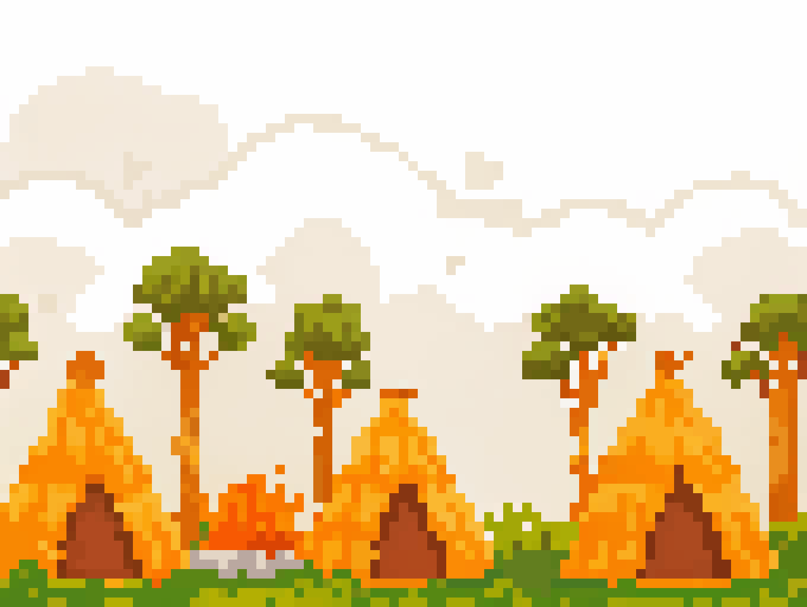
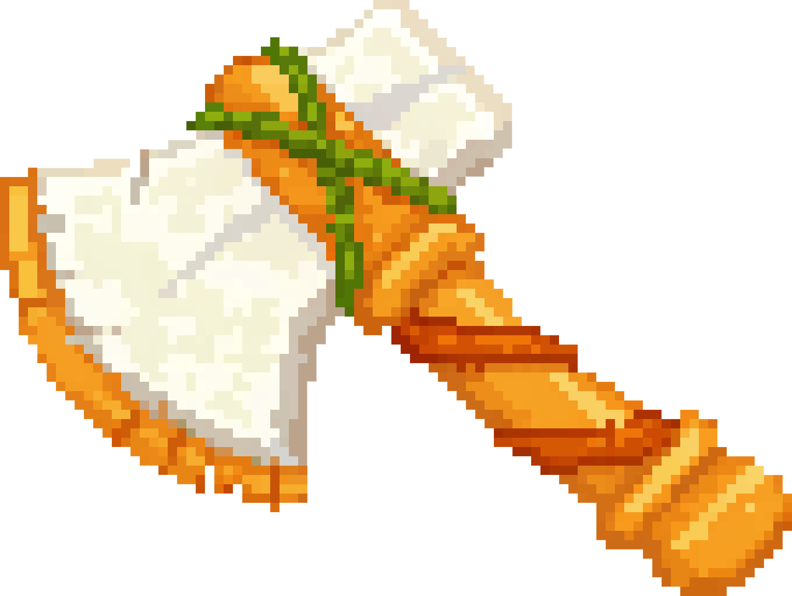
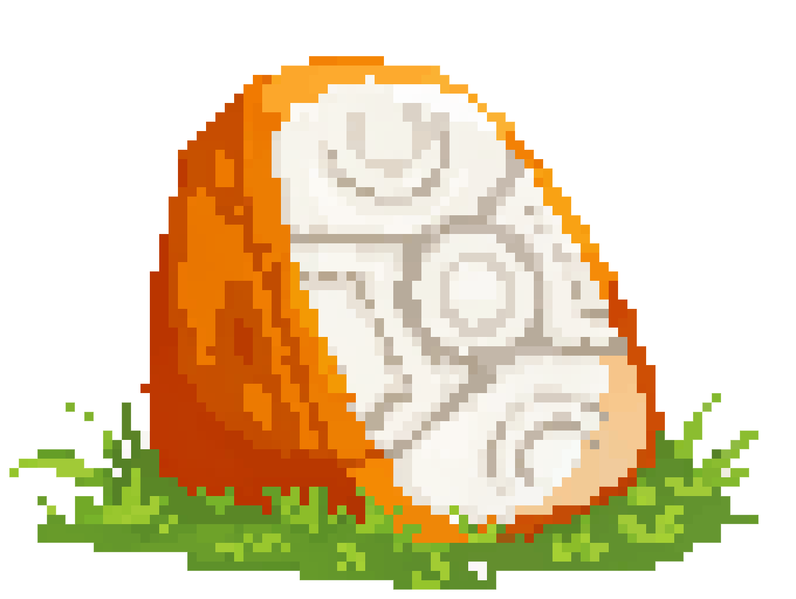
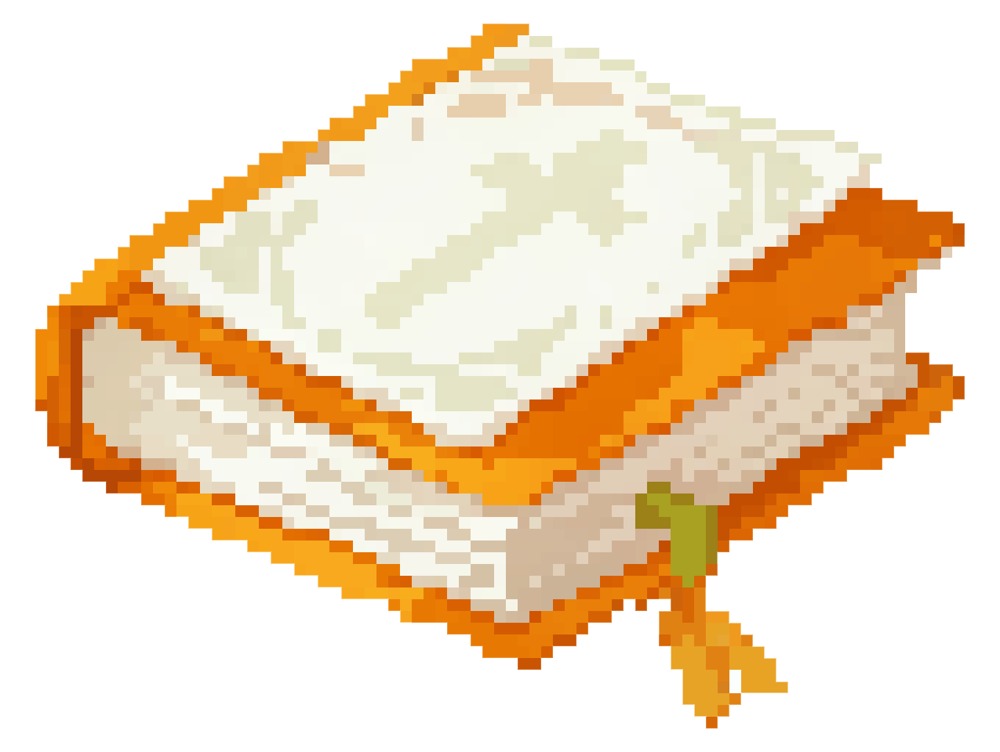
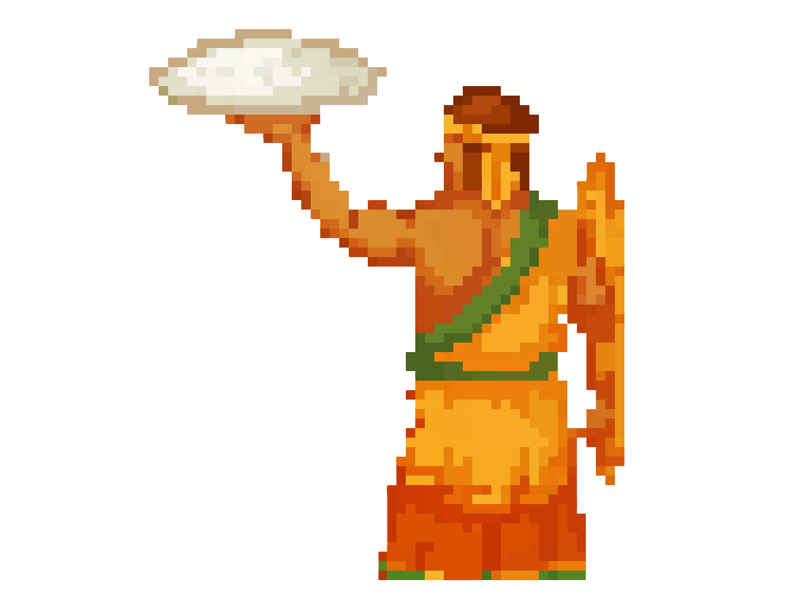

# Yir Yoront Guardian

An HTML5 educational game that symbolizes the cultural conflict faced by the Australian Aboriginal Yir Yoront tribe during modernization. Players take on the role of a tribal guardian, experiencing the balance between tradition and modernity.

🎮 [Play the Game](https://bravohenry.github.io/YirYorontGuardian/)



*Traditional village background representing the Yir Yoront tribe's original lifestyle*

## Game Background 🌍

The Yir Yoront tribe faces the impact of modernization. The stone axe, as a symbol of traditional culture, is not just a tool but a bond that maintains social relationships. The introduction of steel axes, while improving efficiency, has shaken the foundation of traditional culture.

## Game Items and Their Symbolism 🎯

 **Traditional Stone Axe**
- Score: +10 points
- Cultural Impact: Increases balance
- Symbolism: Represents traditional craftsmanship and social bonds

 **Modern Steel Axe**
- Score: +5 points
- Cultural Impact: Decreases balance
- Symbolism: Represents modernization and efficiency

 **Sacred Totem**
- Cultural Impact: Restores balance
- Symbolism: Connection to ancestral wisdom and cultural heritage

 **Religious Item**
- Special Effect: Increases modern influence
- Symbolism: External cultural and religious influences

 **Tribal Guardian**
- Role: Player character
- Symbolism: Bridge between tradition and modernity

## Visual Progression 🎨

<div style="display: flex; align-items: center; gap: 10px;">
    
    ➡️
    
</div>

*As your score increases, the background gradually transitions from traditional to modern, symbolizing cultural change*

## How to Play 🎮

- Use arrow keys to move left and right
- Catch falling items:
  - Stone Axe (Traditional): +10 points, increases cultural balance
  - Steel Axe (Modern): +5 points, decreases cultural balance
  - Totem Fragment: Restores cultural balance
  - Religious Item: Temporarily increases steel axe drop rate

## Game Features ✨

- Educational game theme
- Simple yet deep gameplay mechanics
- Dynamic difficulty adjustment
- Random events system
- Cultural balance mechanism
- Progressive modernization visual effects
- Pixel art style with retro aesthetics

## Technical Requirements 💻

- Modern browser with HTML5 support
- Recommended resolution: 1024x768 or higher

## Development Stack 🛠

- HTML5 Canvas
- JavaScript
- CSS3
- Press Start 2P Font

## How to Run Locally 🚀

1. Clone the repository
```bash
git clone https://github.com/bravohenry/YirYorontGuardian.git
```
2. Open `index.html` in a modern browser
3. Start playing!

## Educational Goals 📚

- Understanding the complexity of cultural conflicts
- Experiencing the balance between tradition and modernity
- Recognizing the importance of cultural preservation
- Fostering understanding and respect for diverse cultures

## Game Assets 📝

All game assets are original designs:
- player.png - Tribal guardian character
- traditional.png - Traditional stone axe
- modern.png - Modern steel axe
- totem.png - Totem fragment
- bible.png - Religious item
- game-bg.png - Traditional background
- game-bg2.png - Modern background

## Contributing 🤝

Contributions are welcome! Please feel free to submit a Pull Request.

## License 📄

This project is licensed under the MIT License - see the LICENSE file for details.

## Acknowledgments 🙏

- Inspired by the real historical events of the Yir Yoront tribe
- Font: Press Start 2P by CodeMan38
- Special thanks to all contributors and testers

---

### Project Information 📋

**Designer:** Zihan Huang  
**LinkedIn:** [@zihanhwang](https://www.linkedin.com/in/zihanhwang/)  
**Institution:** Savannah College of Art and Design (SCAD)  
**Course:** Innovation: Past, Present, and Future (DMGT-702)  
**Term:** Winter 2025

---
Made with ❤️ for cultural preservation and education 